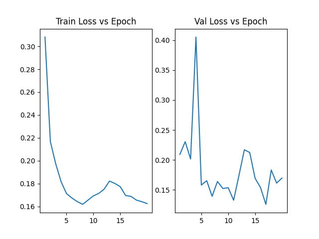
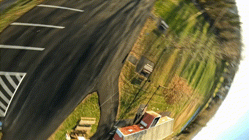
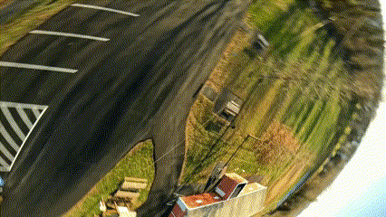

## Video_Frame_Interpolation
[](https://opensource.org/licenses/MIT)
---
## Contributors

1) [Rajan Pande](https://github.com/rpande1996): 
Graduate Student of M.Eng Robotics at University of Maryland. 
2) [Ishan Tamrakar](https://github.com/ishantja): 
Graduate Student of M.Eng Robotics at University of Maryland.

## Overview

This code generates interpolated frames for increasing the video FPS using modified RRIN network

## Softwares

* Recommended IDE: PyCharm 2021.2

## Libraries

* Numpy 1.21.2
* Matplotlib 3.6.1
* OpenCV 4.6.0
* PyTorch 1.12.1+cu116
* SciKit-Image 0.19.3
* Wget 3.2

## Programming Languages

* Python 3.8.12

## License 

```
MIT License

Copyright (c) 2022 Rajan Pande, Ishan Tamrakar

Permission is hereby granted, free of charge, to any person obtaining a copy
of this software and associated documentation files (the "Software"), to deal
in the Software without restriction, including without limitation the rights
to use, copy, modify, merge, publish, distribute, sublicense, and/or sell
copies of the Software, and to permit persons to whom the Software is
furnished to do so, subject to the following conditions:

The above copyright notice and this permission notice shall be included in all
copies or substantial portions of the Software.

THE SOFTWARE IS PROVIDED "AS IS", WITHOUT WARRANTY OF ANY KIND, EXPRESS OR
IMPLIED, INCLUDING BUT NOT LIMITED TO THE WARRANTIES OF MERCHANTABILITY,
FITNESS FOR A PARTICULAR PURPOSE AND NONINFRINGEMENT. IN NO EVENT SHALL THE
AUTHORS OR COPYRIGHT HOLDERS BE LIABLE FOR ANY CLAIM, DAMAGES OR OTHER
LIABILITY, WHETHER IN AN ACTION OF CONTRACT, TORT OR OTHERWISE, ARISING FROM,
OUT OF OR IN CONNECTION WITH THE SOFTWARE OR THE USE OR OTHER DEALINGS IN THE 
SOFTWARE.
```

## Demo

Loss graphs:



Results:

|  Original Video  | Interpolated - 60FPS | Interpolated - 120FPS |
|:----------------:|:--------------------:|:---------------------:|
|| ||


## Build

```
git clone https://github.com/rpande1996/Video_Frame_Interpolation
cd Video_Frame_Interpolation/src
```
In order to train the network:
>To download dataset:
>```
>python dataset_dl.py
>```

>To train the network:
>```
>python train.py
>```

>To test the network:
>```
>python evaluate.py
>```

>If you want to plot your losses:
>```
>python plot_stats.py
>```

You can use the model to either generate 1 frame or generate a complete video:
>To generate one single interpolated frame:
>```
>python generate.py
>```

>To generate a complete video:
>```
>python convert_vid.py
>```
